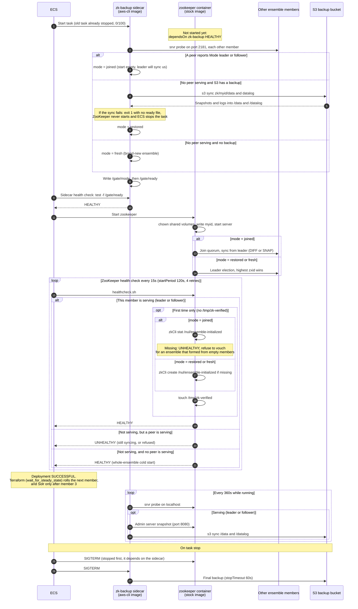
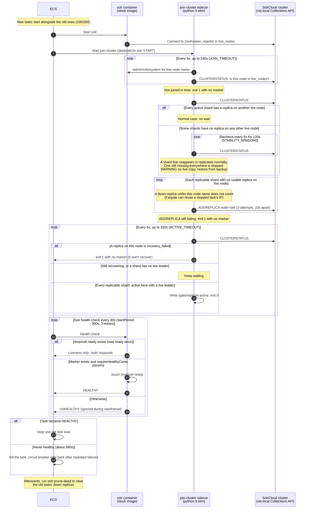

## Description

This terraform project includes the resources required to get the Solrcloud (Solr / Zookeeper) cluster running.

## Prerequisites

* [core](../core/README.md)

## Secrets

* `state_bucket` - The bucket containing remote state files (default: `nulterra-state-sandbox`)
* `zookeeper.cpu` - The amount of CPU to reserve for each zookeeper instance (default: `256`)
* `zookeeper.memory` - The amount of RAM to reserve for each zookeeper instance (default: `512`)
* `solr.cluster_size` - The number of Solr nodes to run (default: `4`)
* `solr.cpu` - The amount of CPU to reserve for each solr instance (default: `1024`)
* `solr.memory` - The amount of RAM to reserve for each solr instance (default: `2048`)

## Deployments

A new Solr task only reports healthy, letting ECS stop an old one, once it hosts an
`active` replica of every collection. A non-essential `join-cluster` sidecar
(`solr-sidecar/join_cluster.py`) adds the replicas. The Solr container's health check
waits for them. See [DEPLOYMENT_UPDATE.md](DEPLOYMENT_UPDATE.md) for the design.

After a rollout, clear the old tasks' replicas with the utility Lambda's `solr:prune-dead`.

A shard with no copy on any other live node (after losing the whole cluster) is skipped
once that has held for 2 minutes. No flag is needed to restore an empty cluster: restore
the collections with `solr:restore`, then run `solr:rebalance` with `expand: true`.

### ZooKeeper

Each member runs the stock `zookeeper` image plus a `zk-backup` sidecar
(`zookeeper-sidecar/backup.sh`, on the stock `aws-cli` image). Before ZooKeeper starts,
the sidecar joins a serving ensemble if there is one, and otherwise restores this
member's S3 backup. After that it backs up every 6 minutes and on shutdown. Members are
the `zookeeper-node/` module, rolled one at a time: each waits for the previous one to be
healthy, meaning part of a serving quorum.

A member that joins a live ensemble requires the `/nul/ensemble-initialized` znode, which
restored or fresh members create. An ensemble without it formed from empty members, and
joining members stay unhealthy rather than vouch for it.

### Startup sequences

A full apply rolls ZooKeeper members 1, 2 and 3 one at a time, each waiting for the
previous one's deployment to be `SUCCESSFUL`, and then Solr.

#### ZooKeeper member



#### Solr node



## Utility Lambda operations

Invoke `<namespace>-solr-utils` with `{"operation": ...}`:

* `solr:status` - `CLUSTERSTATUS`, optionally for one `collection`
* `solr:backup` / `solr:list` / `solr:restore` - backups to the S3 repository
* `solr:rebalance` - delete replicas on nodes that have left the cluster, then add
  replicas up to the replication factor (`expand: true` for every live node, or `node` to
  add one on a specific node). Never deletes a collection.
* `solr:prune-dead` - only delete replicas on nodes that have left the cluster
* `solr:ready` / `zookeeper:ready` - check that the live node count matches `solr.nodeCount` / `zookeeper.nodeCount`

## Outputs

* `solr.endpoint` - The service discovery URL of the solr cluster
* `solr.client_security_group` - The security group for solr client access
* `solr.cluster_size` - The size (number of nodes) of the solr cluster
* `zookeeper.servers` - A list of zookeeper servers in `host:port` format
* `zookeeper.client_security_group` - The security group for zookeeper client access

## Remote State

### Direct Access

```
data "terraform_remote_state" "solrcloud" {
  backend = "s3"

  config {
    bucket = var.state_bucket
    key    = "env:/${terraform.workspace}/solrcloud.tfstate"
  }
}
```

Outputs are available on `data.remote_state.solrcloud.outputs.*`

### Module Access

```
module "solrcloud" {
  source = "git::https://github.com/nulib/infrastructure.git//modules/remote_state"
  component = "solrcloud"
}
```

Outputs are available on `module.solrcloud.outputs.*`
